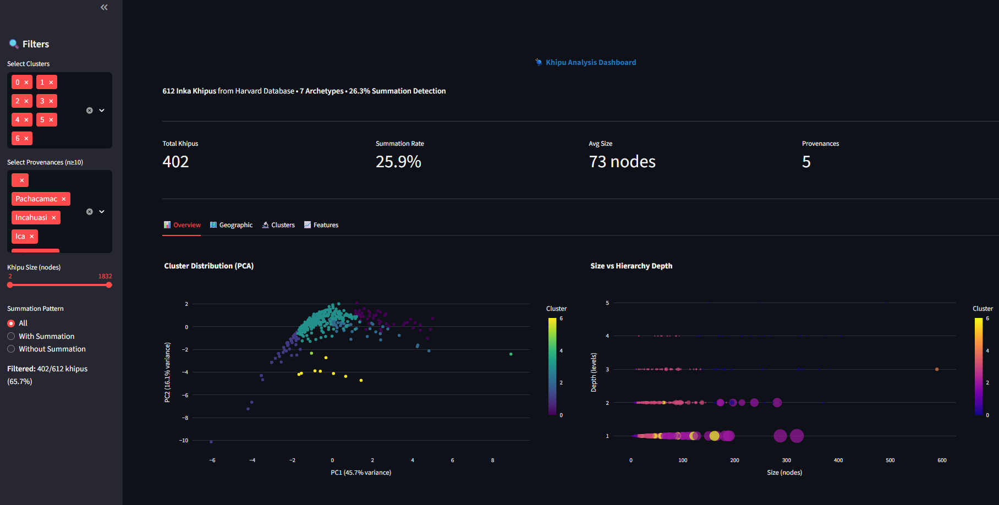
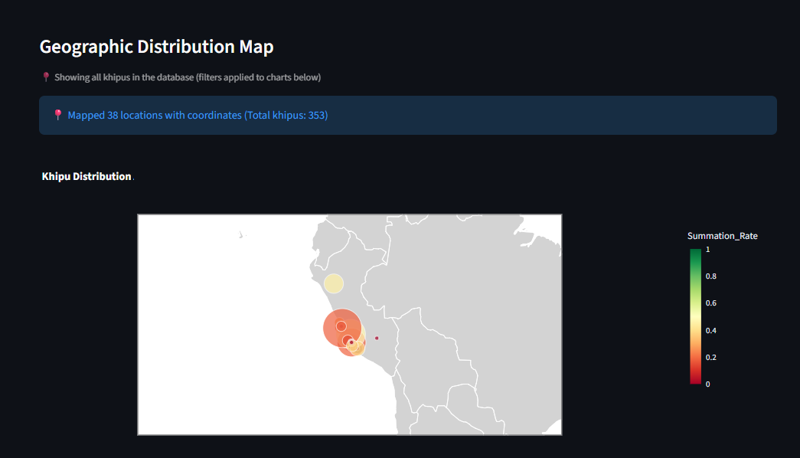
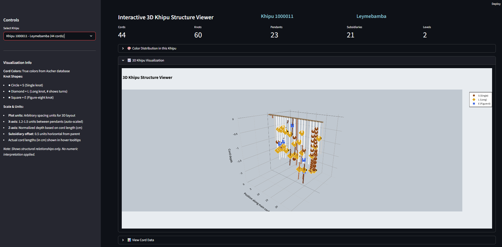
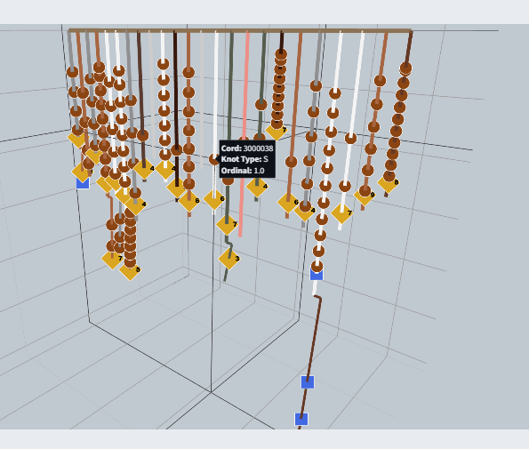
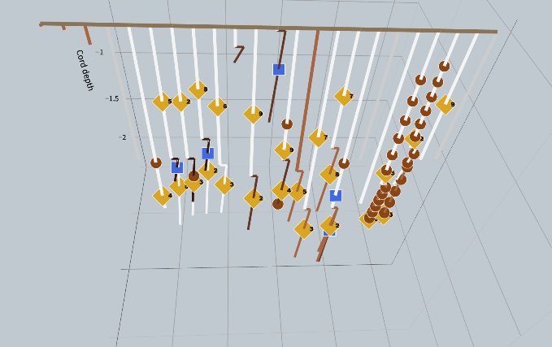
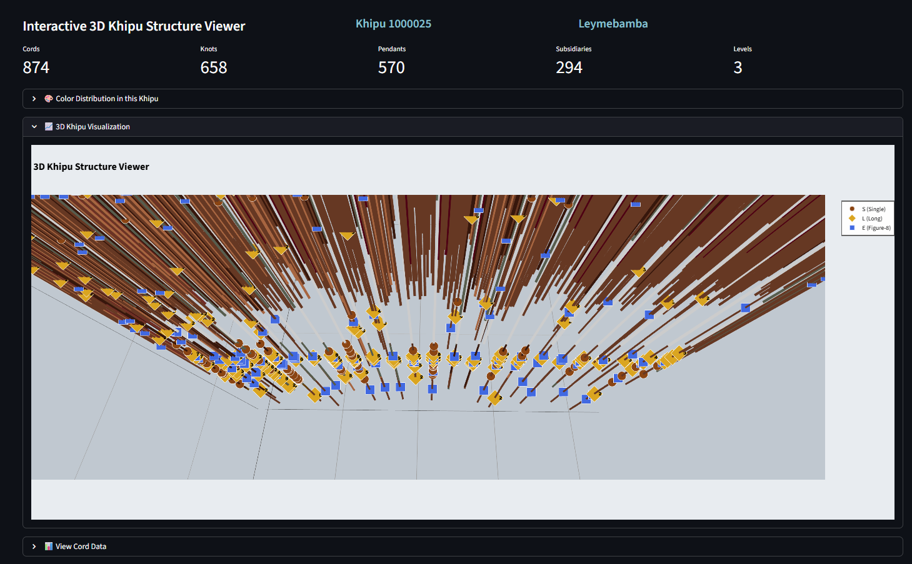
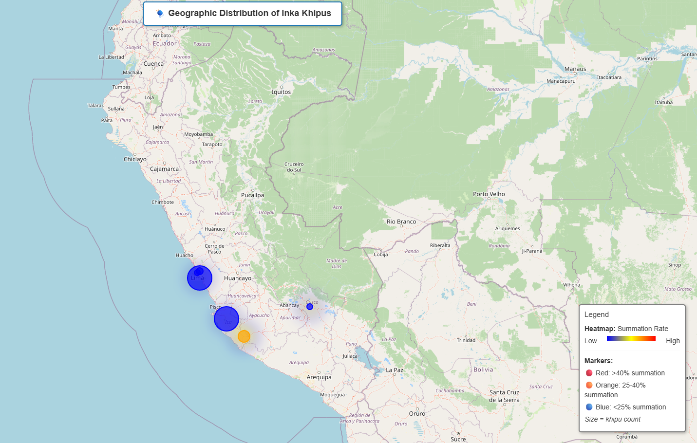
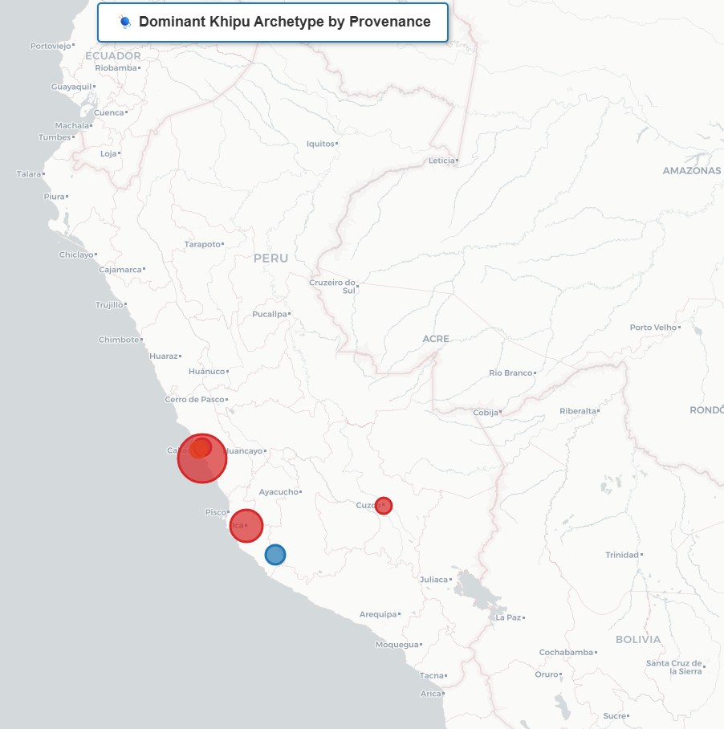

# Advanced Visualizations Guide

This guide explains how to use the advanced visualization tools created for the Khipu Analysis project.

## Configuration Note

All scripts use the centralized configuration system. See [DATA_PATHS.md](../DATA_PATHS.md) for complete setup instructions.

**Quick setup validation:**
```bash
python src/config.py
```

## 🌐 Interactive Web Dashboard

**File:** `scripts/dashboard_app.py`

A comprehensive Streamlit web application for exploring khipu data with real-time filtering and interactive visualizations.


*The main dashboard interface showing PCA scatter plot and cluster distribution*

### Features:
- **Real-time Filtering:** Select clusters, provenances, size ranges, and summation patterns
- **Multi-tab Interface:**
  - **Overview:** PCA scatter, size vs depth, cluster distribution
  - **Geographic:** Interactive Andes region map showing all 612 khipus across 15+ locations, summation rates by provenance, structural features, enrichment heatmap
  - **Clusters:** Detailed cluster analysis with feature distributions
  - **Features:** Correlation analysis and feature relationships
- **Data Export:** Download filtered data and summary statistics as CSV
- **Geographic Map:** Plotly scatter_geo showing complete distribution with fuzzy provenance matching

### Database Access:

The dashboard requires access to the Open Khipu Repository database for provenance data:

- **Default:** Uses `../open-khipu-repository/data/khipu.db` (sibling directory)
- **Custom location:** Set `KHIPU_DB_PATH` environment variable
- **Fallback:** If database not found, provenance shows as "Unknown" but other features work

See [DATA_PATHS.md](../DATA_PATHS.md) for configuration details.

### Usage:
```bash
streamlit run scripts/dashboard_app.py
```

The dashboard will open in your default web browser at `http://localhost:8501`

### Controls:
- Use the **sidebar** to filter data by cluster, provenance, size, and summation pattern
- Switch between **tabs** to explore different aspects of the data
- **Hover** over plot elements for detailed information
- Use **export buttons** at the bottom to download filtered data


*Geographic tab showing khipu distribution across the Andes region*

---

## 📐 3D Khipu Structure Viewer

### Interactive 3D Viewer with Plotly

**File:** `scripts/khipu_3d_viewer.py`


*Main interface showing dropdown selector, interactive Plotly 3D visualization, and overall layout*

Streamlit-based web interface with interactive Plotly 3D visualizations.

**Features:**
- **Dropdown menu** with all 612 khipus (no command-line arguments needed!)
- **Interactive Plotly 3D plots** - Rotate, zoom, pan in real-time using mouse
- **Color-coded cords** - Using authentic Ascher color mappings from database
- **Hierarchical structure** - Main cord, pendants, and subsidiaries clearly distinguished with elbow joints
- **Knot visualization** - Different shapes for S/L/E knots with turn counts displayed as text labels
- **Hover tooltips** - Detailed information on cords, colors, lengths, and knots appears on mouseover
- **Provenance display** - See location and metadata for each khipu
- **Smart layout** - Adaptive spacing based on cord count (1.2x to 1.5x spacing)

**Requirements:**
- Database connection for khipu list and Ascher color mappings
- Plotly and Streamlit installed

**Usage:**
```bash
streamlit run scripts/khipu_3d_viewer.py --server.port 8502
```

The viewer will open at `http://localhost:8502`

**Interface Components:**
- **Left sidebar:** Khipu dropdown selector with ID and provenance information
- **Main panel:** Interactive Plotly 3D visualization with rotation/zoom controls
- **Hover tooltips:** Mouseover any cord or knot to see detailed structural information


*Hover tooltip showing detailed cord/knot information - a key advantage of Plotly over static viewers*


*Clear visualization of hierarchical structure: main cord (horizontal), pendant cords (hanging), subsidiaries (with elbow joints), and knots (S/L/E shapes)*


*Complex khipu with 200+ cords demonstrating scalability, adaptive spacing, and multiple Ascher colors*

**Why use this viewer?**
- **No khipu ID memorization** - Browse through dropdown
- **Real-time 3D manipulation** - Smooth Plotly interactions
- **Hover for details** - No need to click or open separate panels
- **Complete structural fidelity** - No numeric interpretation, pure structure
- **Production-ready** - Actively maintained, handles 200+ cord khipus smoothly
- **Authentic colors** - Uses Ascher color system from database RGB values

### Running Multiple Viewers

You can run both the dashboard and 3D viewer simultaneously:

```bash
# Terminal 1: Main dashboard
streamlit run scripts/dashboard_app.py

# Terminal 2: 3D viewer
streamlit run scripts/interactive_3d_viewer.py --server.port 8502
```

- Dashboard: http://localhost:8501
- 3D Viewer: http://localhost:8502

This allows you to browse the dataset in the dashboard, then inspect interesting khipus in the 3D viewer.

---


*Interactive map showing summation rate intensity across Andean archaeological sites*

## 🗺️ Geographic Heatmap

**File:** `scripts/visualize_geographic_heatmap.py`

Creates interactive maps showing geographic distribution of khipu patterns across archaeological sites in the Andes region.

### Features:
- **Heatmap overlay:** Intensity based on summation rate
- **Interactive markers:** Click for detailed statistics per provenance
- **Color-coded bubbles:**
  - 🔴 Red: >40% summation rate
  - 🟠 Orange: 25-40% summation rate
  - 🔵 Blue: <25% summation rate
- **Bubble size:** Proportional to number of khipus
- **Two maps:**
  1. Summation heatmap (pattern intensity)
  2. Cluster distribution (dominant archetype per region)

### Requirements:
- Database file at `data/khipu.db` (for provenance data)

### Usage:
```bash
python scripts/visualize_geographic_heatmap.py
```

**Outputs:**
- `outputs/visualizations/geographic_heatmap.html` - Summation rate heatmap


*Cluster distribution map showing dominant khipu archetypes by region*

- `outputs/visualizations/geographic_heatmap_statistics.csv` - Aggregated statistics
- `outputs/visualizations/cluster_geographic_map.html`
*Cluster distribution map*

### Viewing:
Open the `.html` files in any web browser. The maps are fully interactive:
- **Zoom:** Mouse wheel or +/- buttons
- **Pan:** Click and drag
- **Info:** Click markers for detailed statistics

---

## 🎨 Visualization Workflow

### Recommended Exploration Sequence:

1. **Start with the Dashboard** to get an overview:
   ```bash
   streamlit run scripts/dashboard_app.py
   ```
   - Filter to specific clusters or provenances of interest
   - Export filtered data for focused analysis

2. **Explore Geographic Patterns**:
   ```bash
   python scripts/visualize_geographic_heatmap.py
   ```
   - Identify regional variations in summation patterns
   - Note provenances with high summation rates

3. **Deep Dive into Individual Khipus**:
   ```bash
   python scripts/visualize_3d_khipu.py --khipu-id <ID> --multi-view
   python scripts/visualize_3d_khipu.py --khipu-id <ID> --summation-flow
   ```
   - Choose khipus from interesting clusters/provenances
   - Examine hierarchical structure in 3D
   - Visualize summation relationships

4. **Use Interactive Notebooks** for hypothesis testing:
   - Open `notebooks/03_khipu_detail_viewer.ipynb` for comprehensive khipu analysis
   - Open `notebooks/04_hypothesis_dashboard.ipynb` for custom statistical tests

---

## 📊 Data Sources

All visualizations use processed data from:
- `data/khipu.db` - SQLite database with khipu metadata and provenance
- `data/processed/phase1/cord_numeric_values.csv` - Numeric values
- `data/processed/phase2/cord_hierarchy.csv` - Hierarchical structure (54,404 cords)
- `data/processed/phase3/summation_test_results.csv` - Summation testing
- `data/processed/phase4/cluster_assignments_kmeans.csv` - 7 archetypes (613 khipus)
- `data/processed/phase4/cluster_pca_coordinates.csv` - PCA projections
- `data/processed/phase4/graph_structural_features.csv` - Structural metrics

---

## 🛠️ Technical Requirements

### Python Packages:
- `streamlit` - Web dashboard framework
- `plotly` - Interactive plotting
- `folium` - Interactive maps
- `matplotlib` - 3D visualization
- `pandas` - Data manipulation
- `numpy` - Numerical computing
- `networkx` - Graph analysis
- `statsmodels` - Statistical analysis
- `sqlite3` - Database access (standard library)

Install required packages:
```bash
pip install streamlit plotly folium matplotlib pandas numpy networkx statsmodels
```

### System Requirements:
- **RAM:** 2GB minimum (4GB recommended for dashboard)
- **Browser:** Modern browser (Chrome, Firefox, Edge) for HTML maps
- **Display:** 1920×1080 recommended for dashboard

---

## 🎯 Use Cases

### Archaeological Research:
- Compare khipu structures across regions
- Identify regional traditions and variations
- Discover outliers and unique specimens

### Data Quality:
- Visual inspection of complex hierarchies
- Verification of summation patterns
- Identification of potential transcription errors

### Publications:
- High-resolution 3D visualizations (300 DPI)
- Interactive supplements (HTML maps)
- Summary statistics for tables

### Teaching:
- Interactive demonstrations of khipu structure
- Real-time exploration in classroom settings
- Hands-on data analysis exercises

---

## 📝 Notes

- **Dashboard:** First launch may take 10-15 seconds to load data
- **3D Viewer:** Matplotlib 3D is interactive - click and drag to rotate
- **Maps:** Require internet connection for base map tiles
- **Export:** All visualizations can be saved as high-resolution images (PNG, 300 DPI)

---

## 🐛 Troubleshooting

**Dashboard won't start:**
- Ensure port 8501 is available: `netstat -ano | findstr :8501`
- Try alternate port: `streamlit run scripts/dashboard_app.py --server.port 8502`
- Kill existing Streamlit: `Stop-Process -Name streamlit -Force`

**3D viewer shows empty plot:**
- Use interactive viewer (`interactive_3d_viewer.py`) instead of command-line version
- Khipu IDs start at 1000000, not 1
- Verify khipu ID exists: Check dropdown list in interactive viewer
- Ensure khipu has cord data (not one of the 7 filtered empty records)

**Geographic map shows only 3 locations:**
- This was a bug - now fixed! Map uses full dataset, not filtered data
- Fuzzy matching covers 15+ locations (Pachacamac, Ica, Nazca, Leymebamba, etc.)
- Refresh dashboard if you still see old version
- Empty provenance strings are filtered out by design

**Database errors:**
- Ensure `data/khipu.db` exists (copy from Open Khipu Repository)
- Expected path: `C:\code\khipu-computational-toolkit\data\khipu.db`
- Without database, visualizations will work but provenance will show "Unknown"
- Download OKR database from: https://zenodo.org/record/5037551

**Maps show no data:**
- Check that geographic heatmap script completed successfully
- Verify provenance names match `PROVENANCE_LOCATIONS` dictionary
- Dashboard map uses fuzzy matching and shows ~400+ khipus across locations
- Requires database file with provenance information

**Memory issues:**
- Close other applications
- Filter to smaller subsets in dashboard
- Process khipus individually in 3D viewer

---

## 🚀 Next Steps

After exploring these visualizations, consider:
1. **ML Extensions** (Task 7):
   - Function prediction (accounting vs narrative)
   - Anomaly detection (outliers and errors)
   - Sequence prediction for restoration

2. **Custom Analysis:**
   - Modify dashboard to add new visualizations
   - Create animated sequences in 3D viewer
   - Add temporal dimension if dating data available

3. **Publication:**
   - Export high-resolution figures
   - Create interactive supplements
   - Generate summary tables

---

*For questions or issues, refer to the main project documentation in `README_FORK.md`*
